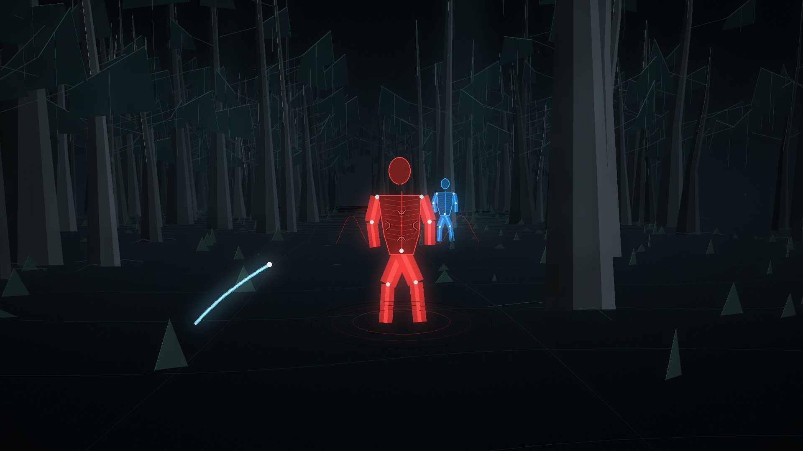

# Muddog-fleer

A 42-second fictional FPS film with a restrained field-simulator aesthetic: shaded forest terrain, bark and roots, layered undergrowth, thermal-style contrast, and synthetic figures. A small hyperbolic reticle accompanies the continuous walk.

**Version 2 is completely wordless:** no opening or closing titles, captions, lettering, numbers, logos or subtitle tracks. The reticle is the only HUD element.

**[Watch / download the wordless v2 MP4](media/Muddog-fleer-v2-8c3b958.mp4)** · [Scene and sound design](docs/film.md)



The central silhouette starts blue. A scripted allegiance cue turns it red at 19 seconds; exactly three short animated light traces follow, then the silhouette diffuses into small particles. Two other silhouettes remain blue throughout. Quiet stereo beacons accelerate during the approach, alongside wind texture, synthetic respiration, footsteps, mechanical clicks and subdued pulse sounds.

This is a procedural game film. Its colors, geometry and timing are authored animation; it does not perform thermal sensing, image recognition or real-world threat classification.

## Reproduce

Requires Python 3.11+, NumPy, Pillow and FFmpeg with H.264/AAC encoding. There are no downloaded scene assets or network calls during rendering.

```sh
python -m pip install -r requirements.txt
python scripts/render_muddog_fleer.py --preview --work-dir ./preview
python scripts/render_muddog_fleer.py
```

The preview command validates camera continuity, the blue/red/projectile sequence and the absence of text-drawing calls, then produces a wordless contact sheet that includes the first and last frames. The full render saves a 1920 × 1080, 24 fps MP4 with stereo audio and a [manifest](media/Muddog-fleer.json) containing the timeline, sound cues, verification results and video checksum. It uses four parallel frame workers by default; pass `--workers 1` to reduce memory use.

Edit [scene.json](src/muddog/scene.json) for the authored scene, [forest.py](src/muddog/forest.py) for scenery geometry, or [render_muddog_fleer.py](scripts/render_muddog_fleer.py) for motion, reticle and sound design. Rendering time depends on the CPU.

## License

The repository's original [GNU Affero General Public License v3.0](LICENSE) is preserved.
